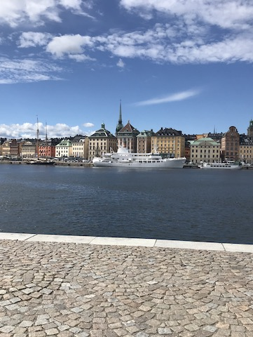

# Welcome
My name is Sophia and I am a PhD student in the Westman Neuroimaging Group at Karolinska Institute in Sweden. The aim of my PhD project is to investigate the heterogeneity of Alzheimer's disease by looking at brain imaging and other biomarkers. I previously studied psychology at both undergraduate and postgraduate level at the University of Glasgow.

  

    
    Glasgow
  

  

    
    Berlin
  

  

    
    Stockholm
  

